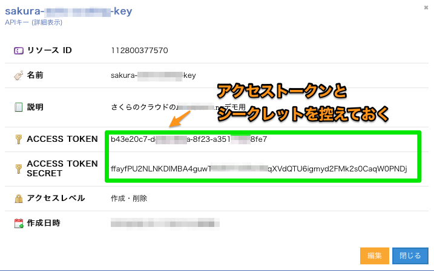

# Installation / インストール

---

## Terraformのセットアップ

- 1) こちらの[公式サイト](https://www.terraform.io/downloads.html)からzipファイルのダウンロードを行います。
- 2) 適当なディレクトリに展開します。
- 3) 2)のディレクトリにパスを通します。


### terraformインストール(Macの場合)

展開先ディレクトリは`~/terraform`として記載しています。

```bash
# ~/terraformディレクトリ作成
$ mkdir -p ~/terraform ; cd ~/terraform
# ダウンロード
$ curl -sL https://releases.hashicorp.com/terraform/0.12.0/terraform_0.12.0_darwin_amd64.zip > terraform.zip
# 展開
$ unzip terraform.zip
# パスを通す
$ export PATH=$PATH:~/terraform/

```

### terraformインストール(Windowsの場合)

ユーザー名を`USER`として記載しています。インストールする環境に応じて適宜読み替えてください。

管理者権限でコマンドプロンプトを起動します。

#### ~/terraformディレクトリ作成

```cmd
> mkdir c:\User\USER\terraform
> cd c:\User\USER\terraform
```

#### ダウンロード

Windows 64bits版をダウンロードし作成したディレクトリに保存します。

#### 展開

対象ファイルを展開します。`c:\User\USER\terraform` の直下に、terraform.exe を配置します。  

```
# パスを通す
> SETX /M PATH “%PATH%;c:\User\USER\terraform”
```

> ※set コマンドで設定出来ているかの確認が出来ます。

### 動作確認

`terraform`コマンドを実行してみましょう。
以下のような表示がされればOKです。

#### terraform動作確認 

```bash
$ terraform help
  Usage: terraform [-version] [-help] <command> [args]
  
  The available commands for execution are listed below.
  The most common, useful commands are shown first, followed by
  less common or more advanced commands. If you're just getting
  started with Terraform, stick with the common commands. For the
  other commands, please read the help and docs before usage.
  
  Common commands:
      apply              Builds or changes infrastructure
      console            Interactive console for Terraform interpolations
      destroy            Destroy Terraform-managed infrastructure
      env                Workspace management
      fmt                Rewrites config files to canonical format
      get                Download and install modules for the configuration
      graph              Create a visual graph of Terraform resources
      import             Import existing infrastructure into Terraform
      init               Initialize a Terraform working directory
      output             Read an output from a state file
      plan               Generate and show an execution plan
      providers          Prints a tree of the providers used in the configuration
      refresh            Update local state file against real resources
      show               Inspect Terraform state or plan
      taint              Manually mark a resource for recreation
      untaint            Manually unmark a resource as tainted
      validate           Validates the Terraform files
      version            Prints the Terraform version
      workspace          Workspace management
  
  All other commands:
      0.12upgrade        Rewrites pre-0.12 module source code for v0.12
      debug              Debug output management (experimental)
      force-unlock       Manually unlock the terraform state
      push               Obsolete command for Terraform Enterprise legacy (v1)
      state              Advanced state management
```

## Terraform for さくらのクラウドのセットアップ

- 1) 以下のリンクから、プラットフォームに応じたzipファイルをダウンロードします
  - [Terraform for さくらのクラウド ダウンロードページ](http://releases.usacloud.jp/terraform/)
- 2) `~/.terraform.d/plugins/`配下に展開します  
     ※ Windowsの場合は`%APPDATA%/terraform.d/plugins/`配下に展開します  
     ※ setコマンドでAPPDATAがどこかを確認出来ます
     

> Note:  
Terraform for さくらのクラウドのバイナリーファイルは[GitHub上のリリースページ](https://github.com/sacloud/terraform-provider-sakuracloud/releases/latest)でも配布しています。

## さくらのクラウドAPIキーの取得

さくらのクラウドのコントロールパネルにログインしAPIキーを発行します。
以下を参考に実施してください。APIキーを発行したら、`ACCESS_TOKEN`と`ACCESS_TOKEN_SECRET`を控えておきましょう。

#### さくらのクラウド コントロールパネルへのログイン


#### さくらのクラウド(IaaS)を選択


#### APIキー発行画面へ移動


#### APIキーの発行


#### 発行されたAPIキーの確認



## さくらのクラウドAPIキーの設定

APIキーは環境変数、またはtfファイルにて設定します。  
ここでは環境変数を利用する方法を記載しています。  
tfファイルでの設定方法は設定リファレンスの[プロバイダ セクション](http://sacloud.github.io/terraform-provider-sakuracloud/configuration/provider/)を参照してください。

#### Mac/Unix系OSなどの場合

```
# アクセストークン
$ export SAKURACLOUD_ACCESS_TOKEN=[入力]

# アクセスシークレット
$ export SAKURACLOUD_ACCESS_TOKEN_SECRET=[入力]

# デフォルトゾーン(石狩第２を指定)
$ export SAKURACLOUD_ZONE=is1b  
```
※env コマンドで設定出来ているかの確認が出来ます。

#### Windowsの場合

管理者権限でコマンドプロンプトを起動します。

```
# アクセストークン
$ setx SAKURACLOUD_ACCESS_TOKEN [入力]

# アクセスシークレット
$ setx SAKURACLOUD_ACCESS_TOKEN_SECRET [入力]

# デフォルトゾーン(石狩第２を指定)
$ setx SAKURACLOUD_ZONE is1b  
```

※設定後、コマンドプロンプトの再起動を行っておいてください。  
※set コマンドで設定出来ているかの確認が出来ます。

## (オプション) Dockerでの実行

TerraformとTerraform for さくらのクラウドを同梱したDockerイメージを用意しています。

[Terraform for さくらのクラウド Dockerイメージ](https://hub.docker.com/r/sacloud/terraform/)

以下のように実行します。

#### Dockerでの実行
```bash
$ docker run -it --rm \
         -e SAKURACLOUD_ACCESS_TOKEN=[さくらのクラウド APIトークン] \
         -e SAKURACLOUD_ACCESS_TOKEN_SECRET=[さくらのクラウド APIシークレット] \
         -v $PWD:/workdir \
         sacloud/terraform apply
```

#### docker-composeでの実行
```bash
# あらかじめ以下コマンドで必要な設定ファイルをダウンロード/編集しておく
# curl -LO https://github.com/sacloud/terraform-for-sakuracloud-docker/raw/master/docker-compose.yml
# curl -L https://github.com/sacloud/terraform-for-sakuracloud-docker/raw/master/env-sample > .env

$ docker-compose run --rm terraform apply
```

## (オプション) Homebrew(Linuxbrew)でのインストール		
  		  
Homebrew(Linuxbrew)をご利用中の場合、以下のコマンドでTerraform for さくらのクラウドをインストール可能です。		
		
    brew install sacloud/terraform-provider-sakuracloud/terraform-provider-sakuracloud		
		
注: brewコマンドでのインストール後、プラグインの有効化のために画面の指示に従って`~/.terraform.d/plugins`配下にシンボリックリンクを作成してください。		
	
	# シンボリックリンク作成の例	
	ln -s /usr/local/opt/terraform-provider-sakuracloud/bin/terraform-provider-sakuracloud_v1.0.5_x4 ~/.terraform.d/plugins/terraform-provider-sakuracloud_v1.0.5_x4
    
